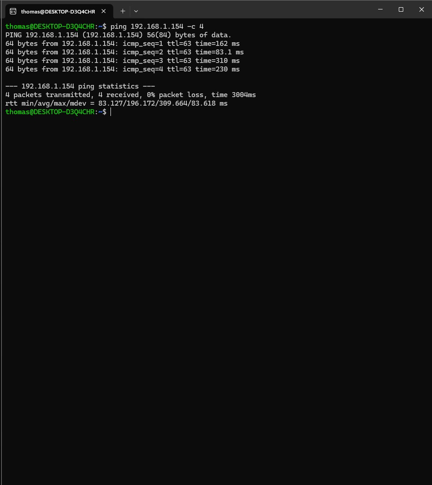

# SSH Brute Force Attack — Incident Investigation

**Date:** July 1-2, 2026  
**Analyst:** Thomas Marvin  
**Severity:** Medium  
**Status:** Resolved — Attack Unsuccessful


## Environment

The target machine `d01` is a physical Ubuntu Server 24.04 host running Wazuh 4.14.5 (manager, indexer, and dashboard all-in-one). Wazuh monitors `d01` through its built-in agent (ID 000), which captures authentication events, system logs, and security alerts locally. The attacker machine was a Windows 11 PC running WSL2 (Ubuntu), on the same 192.168.1.x home network as `d01`.




## Attack Simulation

I simulated an SSH brute force attack using Hydra v9.6 from the attacker machine (`192.168.1.67`) against the `lp01` account on `d01` (`192.168.1.154`) over port 22, using the rockyou.txt wordlist (14.3 million passwords).

```bash
hydra -l lp01 -P rockyou.txt ssh://192.168.1.154 -t 4 -V
```

- `-l lp01` — target username
- `-P rockyou.txt` — password wordlist
- `-t 4` — 4 parallel threads
- `-V` — verbose, show every attempt


## Detection

Wazuh caught it within seconds. Alert count jumped from 36 baseline alerts to 197, with **131 authentication failures** — compared to zero before the attack started.


**Rules that fired:**

- Rule 5760 — `sshd: authentication failed` (level 5)
- Rule 2501 — `syslog: User authentication failure` (level 5)
- Rule 2502 — `syslog: User missed the password more than one time` (level 10)
- Rule 5758 — `Maximum authentication attempts exceeded` (level 8)
- Rule 5557 — `unix_chkpwd: Password check failed` (level 5)

**MITRE ATT&CK:** T1110 (Brute Force), T1110.001 (Password Guessing), T1021 (Remote Services)


## Investigation

I clicked into a raw alert in the Wazuh Events tab to confirm the source. Here's what the log showed:

**Source IP:** 192.168.1.67 (attacker/WSL machine)  
**Target user:** lp01  
**Target port:** 22 (SSH)  
**Agent:** d01 (ID 000)  
**Rule 5760 fired:** 37 times  
**Raw log entry:** `sshd-session[10450]: Failed password for lp01 from 192.168.1.67 port 63626 ssh2`


A few things stood out during the investigation:

- All 131 failures hit at **identical timestamps** — that's not a human mistyping a password, that's an automated tool firing parallel connections simultaneously
- 131 failures vs. 13 successes is an abnormal ratio — legitimate users don't fail that many times in seconds
- Every single failure came from **one source IP** — a real distributed attack would come from many IPs to avoid detection
- `d01` was already defending itself — SSH's `MaxAuthTries` was kicking Hydra's connections before it could get through many attempts, which showed up in Hydra's output as "Connection reset by peer"


## Response

**Containment:** Block `192.168.1.67` at the firewall to cut off further attempts.

**Escalation:** Hand off to SOC Tier 2 to determine if this is targeted or automated scanning, and check for any other indicators of compromise beyond the auth logs.

**Stakeholder notification:** Notify management per incident response policy.

**Outcome:** Attack failed. No credentials were compromised. SSH rate limiting did its job.


## Lessons Learned

- `MaxAuthTries` and a strong password policy stopped this before it got anywhere — defense-in-depth works
- One failed login is noise. 131 simultaneous failures from one IP is a signal. That distinction is the core of alert triage
- Real brute force attacks succeed against weak credentials, disabled rate limiting, or servers exposed directly to the internet — none of those applied here
- Reviewing baseline alerts before the attack (71 alerts, all benign install-time activity) gave me the context to know what normal looked like — without that, separating noise from signal is much harder


## Tools Used

- **Wazuh 4.14.5** — SIEM, alert detection and investigation
- **Hydra v9.6** — SSH brute force simulation  
- **rockyou.txt** — password wordlist, 14.3M entries
- **WSL2 on Windows 11** — attacker environment
- **Ubuntu Server 24.04** — target host (d01)

